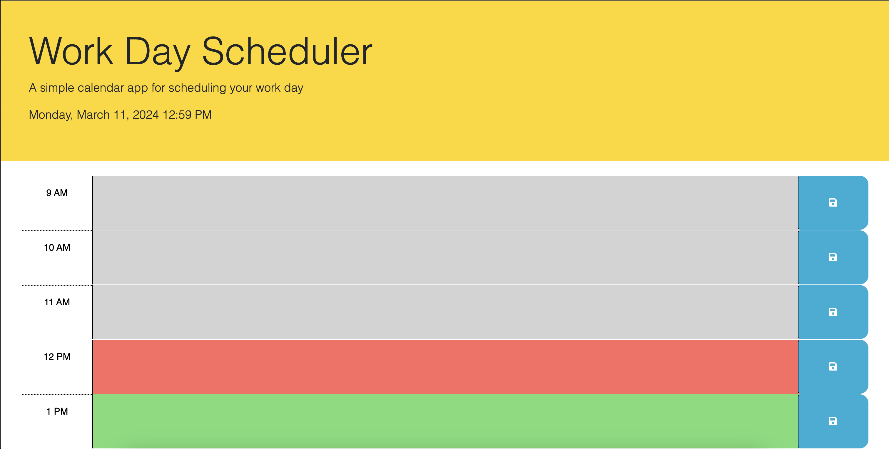

# Work Day Scheduler

## Screenshot 

## Description

This web application is an interactive Work Day Scheduler that I designed to help users manage their daily tasks efficiently. It allows users to save events for each hour of the day, providing a clear overview of the day's tasks. The application updates the color coding of time blocks to indicate whether they are in the past, present, or future.

## Features

- **Dynamic Time Blocks**: Automatically generated time blocks for standard business hours (9AM to 5PM).
- **Local Storage**: Events are saved to the browser's local storage, ensuring that users don't lose their schedule even if they refresh the page.
- **Real-Time Updates**: The scheduler highlights the current hour and updates this in real time, along with displaying the current date and time.

## Link To Application

https://spencerklink.github.io/Schedule-Organizer-/
